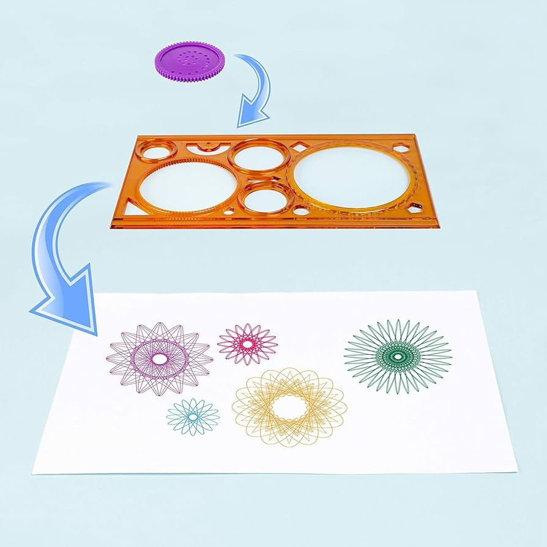
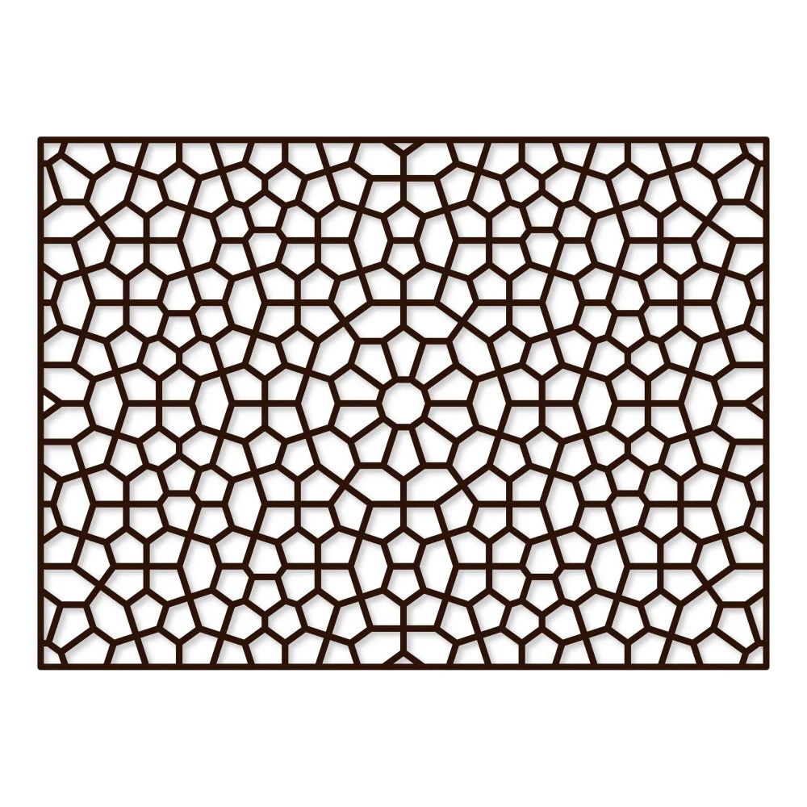

## Data science:

# Algorithmic art أو فن الخوارزميات  
**عبارة عن إننا نخلي الكمبيوتر اللي ما يفهم إلا 0 و1 يصير فنان**

ويش خوارزمية؟ خطوات محددة أو منطقية غالبا تكون رياضية  
نفس يوم نرسم الدالة في الكالكولس، تخيلوا إننا نعطي الكمبيوتر دوال معقدة ما نقدر نرسمها بنفسنا عشان يطلع لنا الفن  

الفن الخوارزمي قديييممم لكن كان محصور على قدراتنا البشرية، لأن الكمبيوترات كانت ضعيفة  

إذا لعبتوا بذي وانتوا صغار هي نفس الفكرة:  

شايفين كيف النقوش في الفن الإسلامي؟ هندسية بامتياز، تتكرر وتتناظر ولها قواعد محددة، الفن الإسلامي خوارزمي بامتياز  

(لو حد مهتم، إسماعيل راجي الفاروقي ناقش كذا مرة ليش الفن الإسلامي تجريدي وتحليله رهييبب)  

---

**لهنا يمكن خلاص للأغلب، وخلوهم يجربوا الموقع وإذا يريدوا يطبعوا، بس لو كانوا مهتمين كملوا**

المهم إن الفن الخوارزمي نفس الشي، قائم على الهندسة لكنه أشمل، دخلت فيه أنواع مثل:

1. fractals:  
مثال عليها الmandlebrot set، معادلة بسيطة  
z(n) = z(n-1) + c  

والناتج:  
https://www.youtube.com/watch?v=6ouG6L-2L3Q  

2. L systems:  
لو حد ماخذ داتا ستركتشر أو يعرف الريكيرجن، هي هذي الفكرة، تكرار لخطوط مستقيمة بزاوية معينة تنتج لنا أشكال مختلفة  

3. generative art:  
نعطيه قاعدة عامة ونعطيه مساحة عشوائية يطلع إبداعه فيها  

المعادلات المفصلة وشرحها في desc.md
website is very intuitive and easy to use, just explore it. One thing not written there: double space = export image -> use this for interactive visuals.